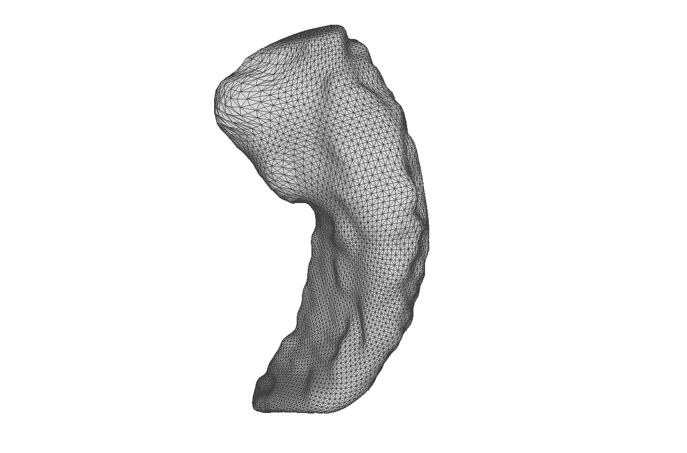
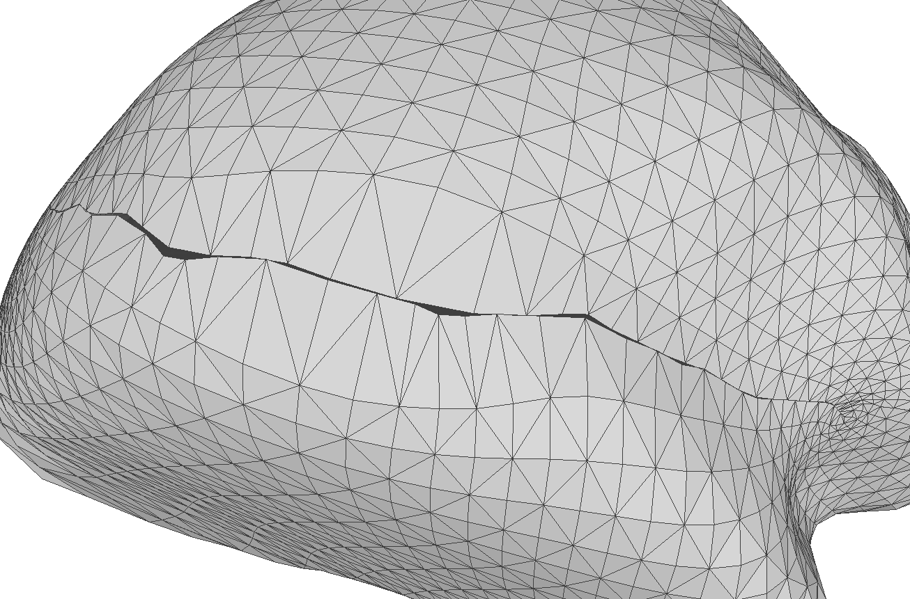

process the m files into obj file 

a docker file for MGMA is needed to copy to here.

the next step is to process obj files into npy file for MGMA.

The try to train the network. 

generate the docker image with the following command line:
```bash
docker-compose build brain
```

Next step is to generate data with obj format and visuliza some of them.

make the image up online
```bash
docker-compose up -d brain
```
enter the container
```bash
docker exec -it brain bash
```

debug inside of a docker container
```
python -m debugpy --listen 0.0.0.0:5566 --wait-for-client generate_obj.py
```

make the generate folder belong to my group
```bash
george@La:~/Projects/brain/workspace$ sudo chown -R george:george obj
```

There is a problem with the mesh. the mesh is not watertight.




copy the manifold to excute the manifold and simplification.

There are totally 841 mesh files.

Next step is to make the simplified mesh file into npy files.

still need to remove redundent lines in each file.
